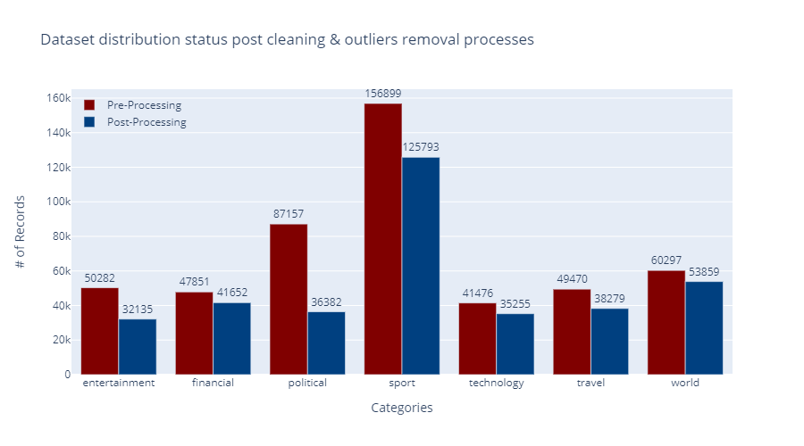
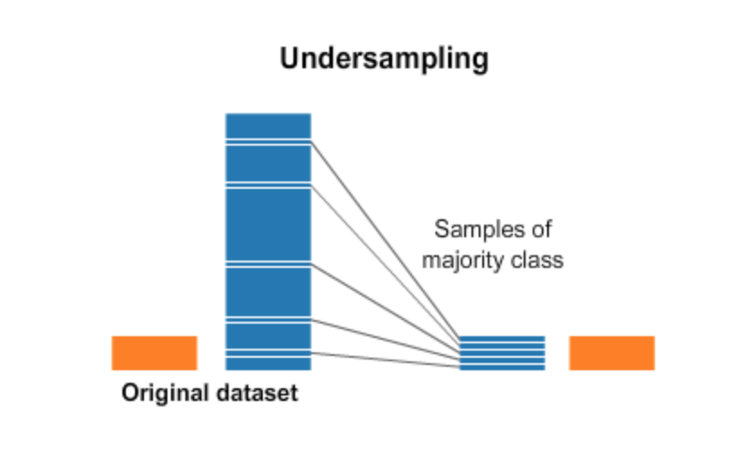
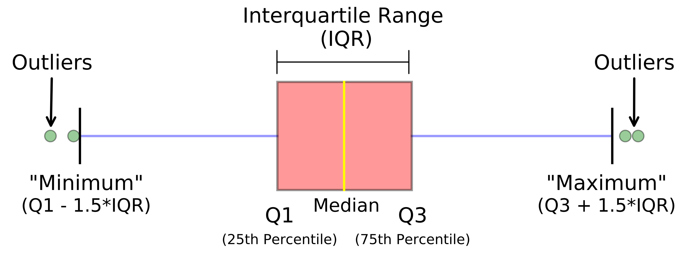
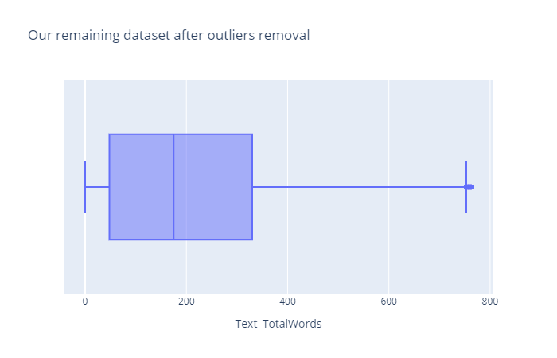
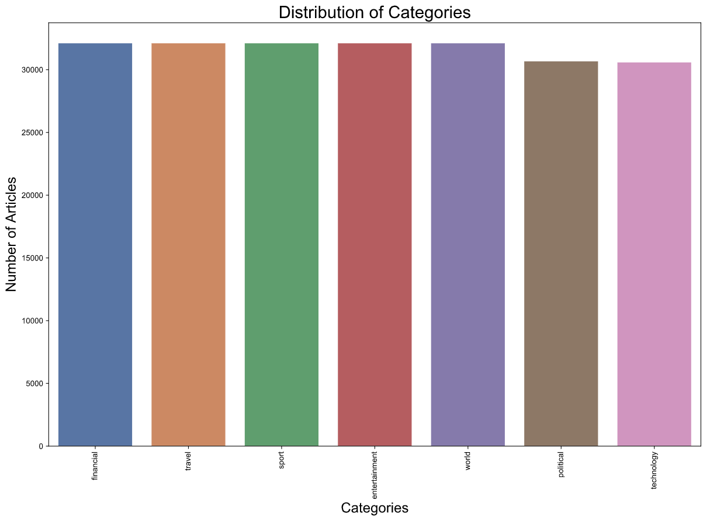
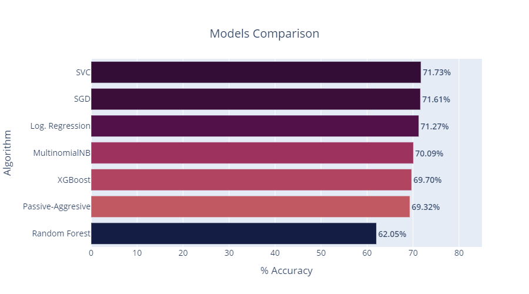

_Note: The present repo is set only for demonstration purposes. If you would like to execute this project, please reach out to me for instructions. If you would like to have a look at the original datasets, you will have to download the files manually as they are too large for uploading them in a Github repo_  
_<b>Important</b>: If Github is unable to load a notebook, please use [Jupyter NBViewer](https://nbviewer.jupyter.org/) by just copying-pasting the Github link of the corresponding notebook. That will render the notebook view properly._

# News Classifier

#### -- Project Status: [Completed]

## Project Intro/Objective

The purpose of this project is to build a news classifier based on textual semi-structured data.
The categories we have are:

1. Political
2. Sport
3. World
4. Entertainment
5. Travel
6. Financial
7. Technology

We would like to test out different classification algorithms and see which one has the highest score but before we do so, our main focus will be on cleaning the data and prepare them for training and testing.

### Methods Used

- Machine Learning
- Data Visualization
- Hyper-parameter tuning
- NLP
- EDA

### Libraries & Technologies

- Python 3
- Dask
- Pandas, Plotly, NLTK, seaborn, sklearn, numpy, WordCloud, collections and more
- Jupyter Notebooks (Anaconda)

## Data source

The data has been collected by Webhose.io, a company that turns multiple vertical web content domains into machine-readable data feeds anyone can access at scale. Webhose is also offering free datasets about news and blog feeds.   Our used datasets can be found [here](https://webhose.io/free-datasets/news-articles-by-topics/)

## Project Highlights & Challenges

### 1. Unbalanced dataset distribution

One of the main challenges I came across was the unbalanced distribution of the dataset. Especially after processing, the distribution did not shift greatly.

### 2. Balancing the distribution of the dataset using a custom undersampling method

  
As you see for the image above, in undersampling we are using the minority class as a max limit to extract samples from the majority class. In general, this method is frequently used in the Machine Learning area, however, it has also a risk of information loss as we remove random samples from another class.  
In order to ensure that we will collect only qualitative records and minimize the risk of information loss, we selected random samples with the help of quantiles in the outliers detection.  

<b>Theory</b>

  

<b>Our dataset's boxplot</b>

  
<b><i>Using Plotly's boxplot I was able to visualize the outliers in 4 quantiles. Next, I identified the number of records of the minority class (let's say X number) and I took X number of random records for every other class but only for the records that were between Q1 and Q3. In that way, I make sure to extract only qualitative records of every downsampled class and reduce the risk of information loss as much as possible.</i></b>
   

<b>Final Dataset</b>

More info in [Data Cleaning pt2](3_Data_Cleaning_pt2.ipynb) and in [EDA.py](EDA.py) file.
    

### 3. Algorithms Comparison - GridSearch Results

Accuracy can be a valid choice for our classification evaluation challenge since the dataset is well balanced. 
As we see from the above image, the best algorithms were by far Support Vectors with the implementation of [SVC](https://scikit-learn.org/stable/modules/generated/sklearn.svm.SVC.html) coming 1st and [SDG](https://scikit-learn.org/stable/modules/generated/sklearn.linear_model.SGDClassifier.html#sklearn.linear_model.SGDClassifier) (stochastic gradient descent) following in 2nd place with a very small difference.

### 4. Pandas crashed as it was unable to locate <b>76GB</b> in RAM for training the model with the full dataset! Now what?

  
For applying our GridSearch, I used a small representation of the whole dataset to save up time and computing capacity. However, I knew that this might be a problem when I will have to fit the model with the whole dataset. There was no way for me to fit the final model in 76GB of memory and I had to search for alternatives.
 

[Dask](https://dask.org/) offers advanced parallelization for analytics while using efficiently disk capacity instead of memory and it can leverage the multi-core CPUs for distributed computing.

That helped me not only to fit the whole dataset but also to see our accuracy improving by <b>8.2%</b> (!).
Eager to know more? Check out [Optimise and Conclusions](6_Optimise_and_Conclusions.ipynb) notebook.

## Future work

As a next step, I would like to expose the model with [FastAPI](https://fastapi.tiangolo.com/) and scrape news feed on a daily basis. The final idea would be to create a self-learning model that will feed new data every day. The usage of such an algorithm could be on classifying future news articles from any source, that have no assigned category. Also a nice addition would be to display in the final user, a buzzword cloud the daily hot articles. In that way, the user sees what the most famous articles of day are talking about.

## Contact

- If you have any questions or remarks about the project, feel free to reach out to me. I am always open for feedback
- My contact info can be found on my personal website: [www.philpappas.com](https://philpappas.com)
